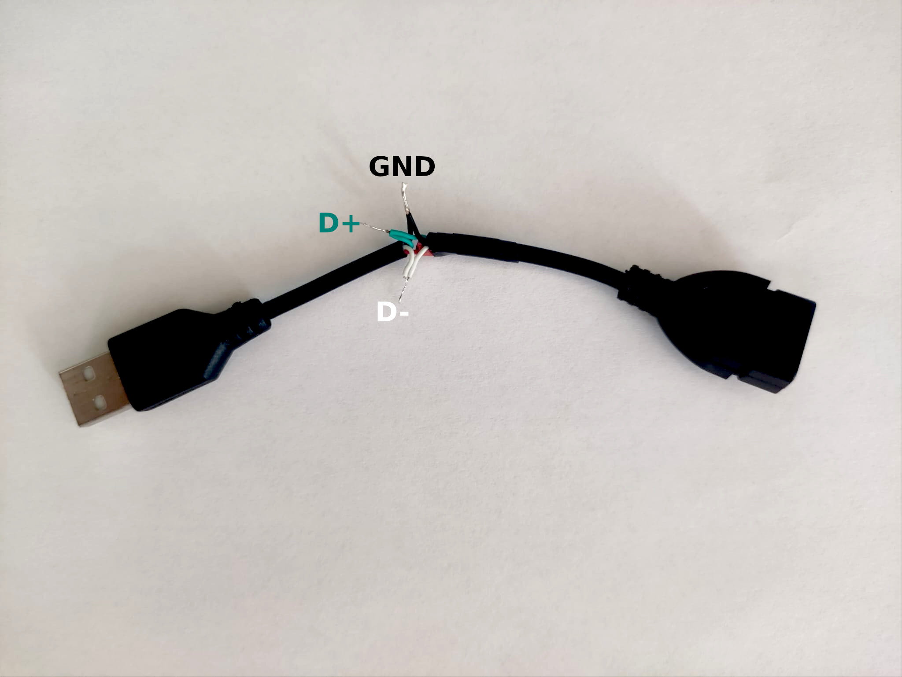
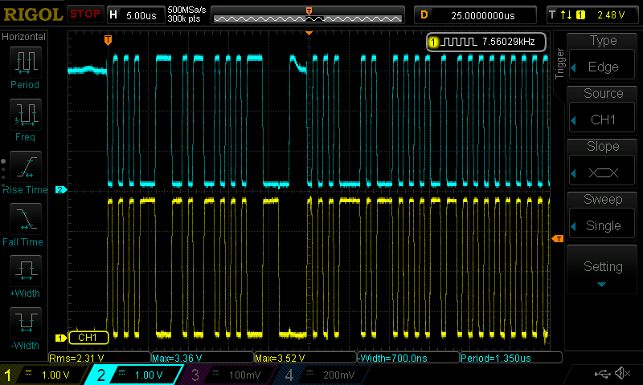

# USB 2.0 parser

When you don’t have a USB sniffer at hand, usb capture and Wireshark
do not work at the lowest level of the USB protocol, but you need to
figure out why the device completes the transaction with an error,
then an oscilloscope and a Python script come to the rescue.

Likely any modern oscilloscope supports
[SCPI](https://en.wikipedia.org/wiki/Standard_Commands_for_Programmable_Instruments)
commands, at least my budget RIGOL DS1054Z does. This brings a great
possibility to fetch sampled data, save it to a file and parse it.

My RIGOL DS1054Z can return up to 6M samples with a sampling rate of
500MHz per channel (two channels will be required), which gives
approximately 12ms of capture of the USB 2.0 protocol (low speed or
full speed devices). This is not too much, but should be enough to
debug an issue.

To receive samples from my RIGOL, I use the following python
[tool](https://github.com/pklaus/ds1054z), which exports the whole
oscilloscope buffer as a CSV file. Easy!

## Wiring

To intercept USB traffic, a USB cable should be modified. What's needed
is a short USB 2.0 extension cable that you don’t mind cutting,
bringing out three wires: D+ (green), D- (white), GND (black):



The oscilloscope channel 1 is attached to D+ (green) and channel 2 is
attached to D- (white). Do not forget about grounding.

## Capture USB

Setup oscilloscope trigger mode as `single` and connect a USB device
to a host. Here is some captured USB communication:



## Retrieve samples

In order to retrieve samples from my RIGOL DS1054Z I use the
[ds1054z](https://github.com/pklaus/ds1054z) tool the following way:

```shell
$ ds1054z save-data --mode RAW
```

This receives full osciloscope buffer, and the whole operation can take
several minutes. Wait time can be minimized by retrieving only screen
samples (exactly those samples which you see on the screen of the
osciloscope) by calling `save-data` without `--mode RAW`, e.g.:


```shell
$ ds1054z save-data
```

Operation completes and tool outputs resulting CSV file which can be
used by the `usb-parse.py` script.

## Parse USB 2.0

Examples of intercepted USB communication can be found in the `data` folder
as gzipped CSV files. For example the very first `SETUP` transaction looks
as the following:

```shell
$ ./usb-parse.py data/host-gamepad_2024-06-24_18-23-23.csv.gz
0.000023 | SETUP | ADDR 10 | ENDP 0 | CRC5 0x1b (OK) | -> [d5 2d 0a d8]
0.000091 | DATA0 | 00 09 00 00 00 00 00 00 | CRC16 0xf426 (OK) | -> [d5 c3 00 09 00 00 00 00 00 00 26 f4]
0.000109 |   ACK | -> [d5 d2]
0.000135 |    IN | ADDR 10 | ENDP 0 | CRC5 0x1b (OK) | -> [d5 69 0a d8]
0.000152 |   NAK | -> [d5 5a]
0.000197 |    IN | ADDR 10 | ENDP 0 | CRC5 0x1b (OK) | -> [d5 69 0a d8]
0.000225 | DATA1 |  | CRC16 0x0000 (OK) | -> [d5 4b 00 00]
0.000239 |   ACK | -> [d5 d2]
```

In this example a simple USB gamepad (low speed HID device) was connected to a
host and host starts a device enumeration procedure.

## What's analysed

`usb-parse.py` script tries to follow the `Chapter 7.1 Signaling` and
`Chapter 8 Protocol Layer` of the USB 2.0 specification, so the following
can be analysed:

* Device speed detection by first samples: low or full speed. Can be specified
  manually by the `--speed (low|full)` parameter
* SE0, SE1 and EOP bus states
* NRZI decoding
* Bit stuffing (except dribble)
* CRC5 and CRC16 handling
* Major PID types

## What's missing

* Transaction sequence details
* Direction of the packet: host -> device, device -> host
* Standard device requests (defined as `9.4 Standard Device Requests`
  in the USB 2.0 specification)

## Summary

By no means can this simple USB protocol analyser replace a
professional USB sniffer due to oscilloscope limited number of samples
it can provide, but sometimes a low-cost (budget and implementation
-wise) solution can help to spot and fix the problem in low-level USB
communication stack.
